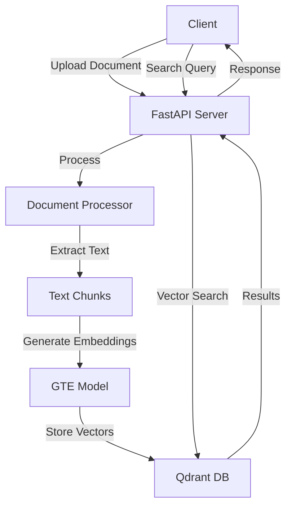

# 📚 Document Management and Query System

[](https://www.python.org/)
[](https://fastapi.tiangolo.com/)
[](https://qdrant.tech/)
[](LICENSE)

> 🔍 A powerful document processing and semantic search system built with FastAPI and Qdrant vector database. Transform your document management with AI-powered search capabilities!

## ✨ Key Features

- 📄 **Multi-Format Support**
  - PDF documents with full text extraction
  - Microsoft Word (DOCX) processing
  - Plain text (TXT) handling
  
- 🧠 **Intelligent Processing**
  - Smart document chunking
  - Semantic embeddings using 'thenlper/gte-small'
  - Context-aware search results
  
- 🔍 **Advanced Search Capabilities**
  - Semantic search functionality
  - Multi-filter query support
  - Relevance scoring
  
- ⚡ **High Performance**
  - Async processing
  - Vector optimization
  - Efficient data retrieval

## 🏗 System Architecture



## 🚀 Quick Start

### Prerequisites

Before diving in, ensure you have:
- 🐍 Python 3.7+
- 🐋 Docker
- 💾 At least 4GB RAM
- 🖥️ Any modern OS (Windows/Linux/MacOS)

### 🛠️ Installation

1. **Clone & Setup**
```bash
# Clone repository
git clone https://github.com/sonpalparmar/QAI.git
cd QAI

# Create virtual environment
python -m venv venv
source venv/bin/activate  # Windows: venv\Scripts\activate
```

2. **Install Dependencies**
```bash
# Core dependencies
pip install -r requirements.txt

# Start Qdrant using Docker
docker compose up -d qdrant
```

3. **Environment Setup**
```bash
# Create .env file
cat << EOF > .env
QDRANT_HOST=localhost
QDRANT_PORT=6333
MODEL_NAME=thenlper/gte-small
MAX_CHUNK_SIZE=512
EOF
```

## 📁 Project Structure

```
🌳 QAI/
├── 📂 app/
│   ├── 📂 file_upload/
│   │   ├── 📜 file_upload.py     # Upload handling
│   │   ├── 📜 file_processing.py # Document processing
│   │   ├── 📜 utils.py          # Helper functions
│   │   └── 📜 query.py          # Search functionality
│   ├── 📜 model.py              # Data models
│   └── 📜 config.py             # Configuration
├── 📜 main.py                   # FastAPI application
├── 📜 requirements.txt          # Dependencies
└── 📜 README.md                # Documentation
```

## 🔌 API Reference

### Document Upload

```http
POST /manage/upload
Content-Type: multipart/form-data

file=@document.pdf
```

#### Response
```json
{
  "status": "success",
  "document_id": "doc_123",
  "metadata": {
    "filename": "document.pdf",
    "size": 1024567,
    "pages": 5,
    "chunks": 15
  }
}
```

### Semantic Search

```http
POST /query/search
Content-Type: application/json

{
  "query": "artificial intelligence applications",
  "top_k": 5
}
```

### Filtered Search

```http
POST /query/filtered_search
Content-Type: application/json

{
  "query": "machine learning",
  "top_k": 5,
  "filters": {
    "source_type": "pdf",
    "date_range": {
      "start": "2023-01-01",
      "end": "2024-01-01"
    }
  }
}
```

## 🔧 Configuration Options

```python
# config.py
SETTINGS = {
    "CHUNK_SIZE": 512,
    "OVERLAP_SIZE": 50,
    "MAX_FILE_SIZE": 10_000_000,  # 10MB
    "SUPPORTED_FORMATS": [".pdf", ".docx", ".txt"],
    "VECTOR_SIZE": 384,
    "BATCH_SIZE": 32
}
```

## 🤝 Contributing

We love your input! We want to make contributing as easy and transparent as possible:

1. 🍴 Fork the repo
2. 🔧 Make your changes
3. ✅ Ensure tests pass
4. 📝 Update documentation
5. 🎉 Submit a PR

## 📈 Performance Tips

- 🚀 Use batch processing for multiple documents
- 💾 Enable caching for frequent queries
- ⚡ Optimize chunk sizes for your use case
- 🔄 Regular index maintenance

## 🐳 Docker Deployment

```bash
# Build image
docker build -t doc-management .

# Run container
docker run -p 8000:8000 doc-management
```

## 📚 Documentation

Complete API documentation is available at:
- Local: `http://localhost:8000/docs`
- Swagger UI: `http://localhost:8000/redoc`

## ⚠️ Known Limitations

- Maximum file size: 10MB
- Supported languages: English (primary), Spanish, French
- Rate limit: 100 requests/minute

## 📝 License

This project is licensed under the MIT License - see the [LICENSE](LICENSE) file for details.

---

<div align="center">

**Built with 💜 by [Sonpal Parmar](https://github.com/sonpalparmar)**

[](https://github.com/sonpalparmar/QAI/stargazers)
[](https://github.com/sonpalparmar)

</div>
